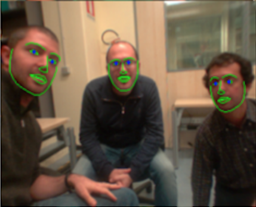

# human-sensing
This repository contains software related to human sensing.
It is currently under major overhauling and all previous software + documentation has been kept in the ***under-review*** branch and will soon be transferred to ***master***. In the meanwhile, if parts of the code is required please use the following git command if you already have a version pf the repo: ```git checkout under-review``` otherwise directly clone the under-review branch: ```git clone -b under-review https://github.com/robotology/human-sensing.git```

## Progress on repository restructuring
Project updates can be found [here](https://github.com/robotology/human-sensing/projects/1)

Table of Contents
=================
* [Repository Structure](#repository_structure)
* [Installation](#installation)
    * [Generic Dependencies](#dependencies)
    * [Face Landmarks Dependencies](#facelandmarks_dep)
    * [Open Pose Dependencies](#openpose_dep)
* [Compilation](#compilation)
* [Documentation](#documentation)

## Repository structure
The human sensing repository contains the following directories and modules:
1. `faceLandmarks`: This yarp module module is configured to find human faces that are looking more or less towards the camera. It makes use of the dlib library in order to extract the facial landmarks and uses the  Histogram of Oriented Gradients (HOG) feature combined with a linear classifier, an image pyramid, and sliding window detection scheme.


2. `yarpOpenPose`: This yarp module is configured to estimate human pose based on OpenPose, a library for real-time multi-person keypoint detection and multi-threading. It makes use of Caffe and OpenCV.


3. `googleVisionAI`: This yarp module is configured to perform image classification using the Vision AI google service, which makes use of AutoML Vision or use pre-trained Vision API models to detect emotion, understand text, and more.

            


At the present time each directory is independent from the others and must be compiled and set up separately.
While we provide specific usage instructions for each one in separate files, we will soon integrate all modules as a unique build procedure.
## Installation

#### Generic Dependencies
In order to compile and run modules in this repository you will need to install the following dependencies.
Installation are standards and instructions can be found in the following links.
- [YARP](https://github.com/robotology/yarp)
- [iCub](https://github.com/robotology/icub-main)
- [icub-contrib-common](https://github.com/robotology/icub-contrib-common)
- [OpenCV](http://opencv.org/downloads.html)

#### Face Landmarks Dependencies

Please find all the related and detailed installation instructions at the [following link](README_Face.md).

#### Open Pose Dependencies

Please find all the related and detailed installation instructions at the [following link](README_Pose.md).

## Documentation
Online documentation is available here: [http://robotology.github.com/human-sensing](http://robotology.github.com/human-sensing).

## License

Material included here is Copyright of _iCub Facility - Istituto Italiano di Tecnologia_ and is released under the terms of the GPL v2.0 or later. See the file LICENSE for details.
